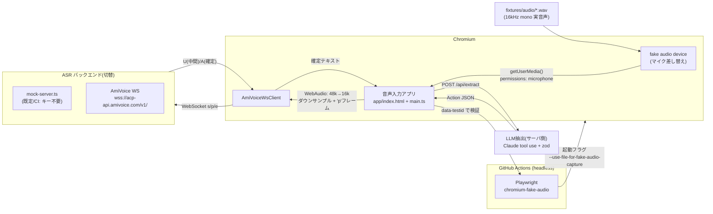
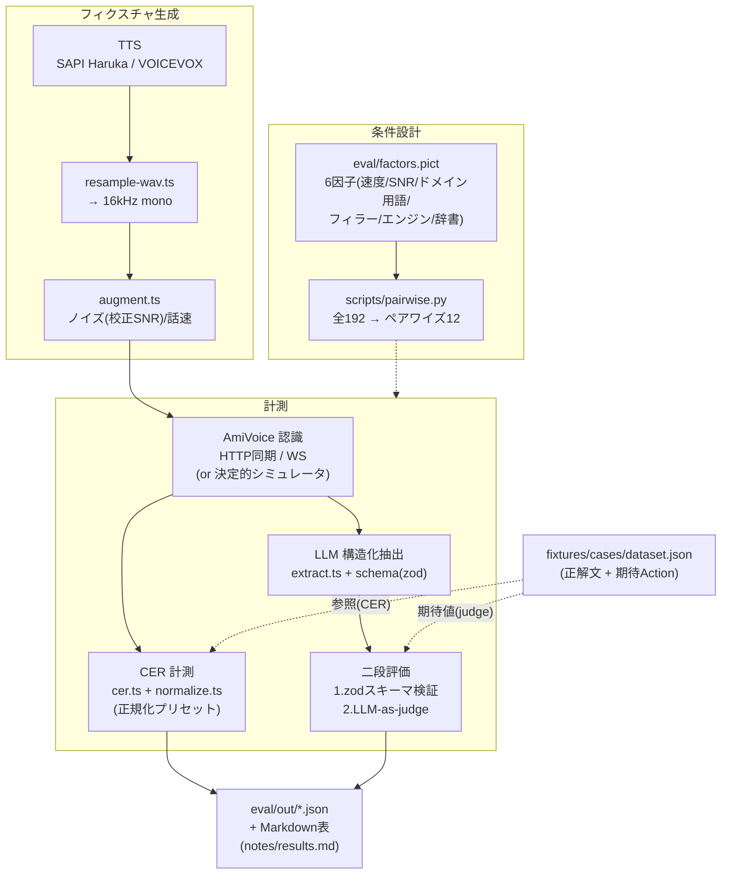

# アーキテクチャ(構成図の元ネタ)

## 図1. Playwright fake-audio E2E(音声入力アプリの一気通貫テスト)

**ポイント**: ASR バックエンドは mock と実 AmiVoice を**同一WSプロトコルで切替**。
CI は mock(キー不要・クーポン消費ゼロ)、実APIE2Eは `USE_MOCK_ASR=false` で同じテストが通る。

---

## 図2. 評価ハーネス(ASR×LLM パイプラインの回帰テスト)

**ポイント**: 「ASR の CER」だけでなく「**ASR誤り → LLM構造化出力の破綻**」まで一気通貫で計測。
LLM出力は **zod(形)+ LLM-as-judge(意味)** の二段で検証する。

---

## コンポーネント対応表

| 層 | ファイル | 役割 |
|---|---|---|
| 音声入力アプリ | `app/index.html`, `app/src/main.ts` | マイク録音UI・表示 |
| WSクライアント(ブラウザ) | `app/src/amivoice-ws-client.ts` | 48k→16k変換, s/p/e送信 |
| アプリサーバ | `app/server.ts` | 静的配信 + esbuildバンドル + /api/extract |
| AmiVoice(同期/非同期/WS) | `src/amivoice/{http-sync,http-async,ws-node}.ts` | 3つのI/F |
| モックASR | `src/amivoice/mock-server.ts` | オフラインE2E/CI用テストダブル |
| 音声処理 | `src/audio/{wav,augment}.ts` | WAV入出力, リサンプル, ノイズ/話速 |
| 評価 | `src/eval/{cer,normalize,judge}.ts` | CER, 正規化, judge |
| LLM | `src/llm/{extract,schema}.ts` | 構造化抽出 + zodスキーマ |
| 条件設計 | `eval/factors.pict`, `scripts/pairwise.py` | PICTペアワイズ |
| 計測実行 | `scripts/measure-*.ts`, `run-eval.ts` | 実測 & 集計 |
| CI | `.github/workflows/{ci,e2e,eval-nightly}.yml` | PR軽量 / E2E / 夜間フル |
