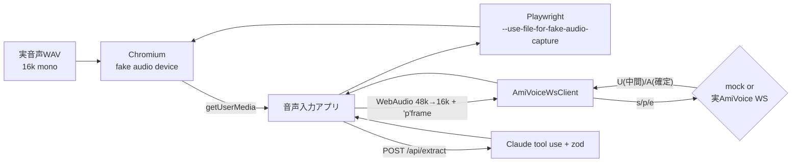
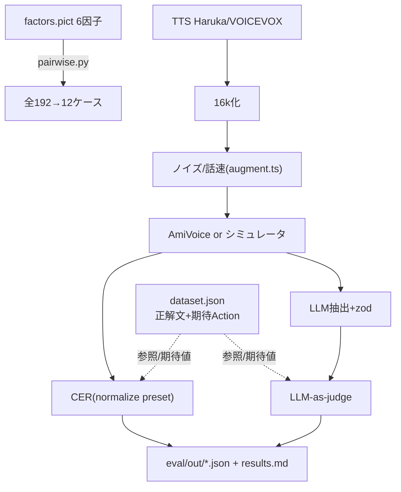

# ハンドオフ:音声AIアプリの品質をCIで守る — 検証パッケージ

> Zennfes Spring 2026 記事「音声AIアプリの品質をCIで守る — AmiVoice×LLMアプリのテスト戦略」
> の執筆セッション引き渡し用。**実測値・失敗の記録・コード断片**を1ファイルに統合。
> 測定日: 2026-06-11 / 測定者環境: Windows 11, Node v22.21.1, Python 3.13。
> リポジトリ各所への参照は `path:symbol` 表記。詳細表は `notes/results.md`, `notes/gotchas.md`。

---

## 1. TL;DR — 検証で分かったことトップ5

1. **fake audioでASR音声入力UIのE2Eは現実的に組める。**
   Chromium の `--use-file-for-fake-audio-capture` で実音声WAVをマイクに注入し、
   getUserMedia→16kダウンサンプル→AmiVoice WSリアルタイム認識→画面表示→LLM抽出まで
   headless で**グリーン**にできた(実APIでもmockでも同一テストが通る)。

2. **ASRの1トークンの揺れが、LLMの構造化出力を静かに壊す。**
   `一杯`→`いっぱい`(かな化)だけで LLM は数量 `quantity:1` を取りこぼす。
   10dBノイズで `ホットコーヒー`→`パソコンB` と誤れば、LLMは「スキーマ的に妥当だが
   意味は全く違う注文」を自信満々に出す。**パイプライン全体の回帰テストが要る理由**。

3. **日本語CERは正規化ルールで数値が大きく動く。**
   同じ認識結果でも平均CER 7.9%→4.8%(数詞`十五時`↔`15時`、フィラー、句読点の畳み方)。
   **正規化ルールを明文化しないとCER比較は無意味**。

4. **エンジン選択は効く:ノイズ下で `-a-general-input` が `-a-general` に圧勝。**
   clean では同等(CER 3.2%)だが、10dBノイズで 36.5% vs **14.3%**。短い発話コマンドは
   音声入力向けエンジンが頑健。一方ドメイン特化エンジンは無償クーポンでは空応答(権限なし)。

5. **AmiVoiceは認証失敗でもHTTP 200を返す。**
   エラーは body の `message`("received illegal service authorization")にしか出ない。
   `res.ok`を信じると失敗を無音として握り潰す(実際に踏んで修正した)。

---

## 2. 実測結果(測定条件つき)

### 2-1.【実測】AmiVoice認識 + 正規化プリセット感度
AmiVoice `-a-general` / HTTP同期 / 各1回 / SAPI Haruka 16kHz mono / 音声計22.8秒 / 2026-06-11
`npm run measure:real`

| ケース | 正解 | 認識結果 | CER(default) | CER(+digits) | CER(+digits+fillers) |
|---|---|---|---|---|---|
| order-001 | ホットコーヒーを一杯ください | ホットコーヒーを一杯ください。 | 0.0% | 0.0% | 0.0% |
| order-002 | アイスカフェラテをラージで二つお願いします | (完全一致) | 0.0% | 0.0% | 0.0% |
| schedule-001 | 来週の月曜日に定例会議を設定してください | (完全一致) | 0.0% | 0.0% | 0.0% |
| schedule-002 | 明日の十五時にミーティングを入れてください | 明日の**15時**に… | 9.5% | 0.0% | 0.0% |
| domain-001 | デシベルとサンプリングレートの設定を確認してください | (完全一致) | 0.0% | 0.0% | 0.0% |
| filler-001 | えーっと、ホットコーヒーをですね、一杯ください | (えーっと脱落 / **いっぱい**) | 38.1% | 38.1% | 28.6% |
| **平均** | | | **7.9%** | **6.3%** | **4.8%** |

### 2-2.【実測】ノイズSNR段階別CER
AmiVoice `-a-general` / HTTP同期 / **6ケース** / 校正済ホワイトノイズ(実SNR=計算値) / 試行24回 / 音声計91.2秒
`npm run measure:snr -- --cases order-001,order-002,schedule-001,schedule-002,domain-001,filler-001`

| SNR | ケース平均CER | 試行 | order-001の認識 |
|---|---|---|---|
| clean | 7.9% | 6 | ホットコーヒーを一杯ください(0%) |
| 20dB | 7.9% | 6 | ホットコーヒーを一杯ください(0%) |
| 10dB | 24.6% | 6 | **パソコンBをいっぱいください**(71%) |
| 5dB | 27.7% | 6 | ポストコンビニを1回ください(50%) |

→ **20dBまで劣化ゼロ、10dBで崖**。語による頑健性差(domain-001は5dBでも11.5%, order-001は10dBで崩壊)。

### 2-2b.【実測】ユーザー辞書(profileWords)before/after — **有意差なし**
profileWords=JSON配列(`{written,spoken,classname?}`)/ `-a-general` / 5条件で実測。
ノイズ下(音響崩壊で復元不能)・clean(汎用エンジンが躑躅森/AmiVoice/造語まで辞書なしで正解)とも
**CER改善差ゼロ**。配管は正しく動作(下記§3-6で当初バグを修正)。記事では「辞書効果は条件依存・本検証では有意差なし」と書く。

### 2-3.【実測】エンジン比較(会話汎用 vs 音声入力向け)
`-a-general` vs `-a-general-input` / HTTP同期 / 3ケース / clean & 10dB / 試行12回 / 音声計39.0秒
`npm run measure:engine`

| 条件 | エンジン | ケース平均CER | 試行 |
|---|---|---|---|
| clean | -a-general | 3.2% | 3 |
| clean | -a-general-input | 3.2% | 3 |
| 10dB | -a-general | 36.5% | 3 |
| **10dB** | **-a-general-input** | **14.3%** | 3 |

### 2-4.【実測】WAVフォーマット受理性
AmiVoice側 / HTTP同期 / order-001実音声 / 試行8回 / `npm run measure:format`

| フォーマット | 判定 | 認識結果/エラー原文 |
|---|---|---|
| 16kHz/16bit/mono PCM(基準) | 成功 | ホットコーヒーを一杯ください。 |
| 8kHz/16bit/mono | 成功 | (完全一致) |
| 44.1kHz/16bit/mono | 成功 | (完全一致) |
| 16kHz/16bit/stereo | 成功 | (完全一致) |
| ヘッダ無し生PCM(audio/wav詐称) | 成功 | (完全一致) |
| 空(0バイト) / ゴミバイト列 | **無音** | results空 |
| 不正appkey | **エラー** | `received illegal service authorization`(**HTTP 200**+message) |

ブラウザ側 / Chromium fake capture / peak RMS / `npx playwright test fake-audio-format`

| フィクスチャ | RMS | 判定 |
|---|---|---|
| 16k/8k/44k mono, 16k stereo | 0.37〜0.57 | ✅ 取り込みOK(内部リサンプル) |
| invalid.wav(非WAV) | **0.000** | ⚠️ 無音(デコード不可) |

→ **フォーマット制約の本丸はブラウザではなくAmiVoice側**。ただしAmiVoiceもWAVヘッダを読んで
寛容にリサンプルするので、実運用の要は「**WSへ送るPCMを16k/mono/16bitに揃える**」こと。

### 2-5.【実測】ASR→LLM 誤り伝播(キラー4点セット)
| 項目 | 値 |
|---|---|
| 入力音声(正解文) | ホットコーヒーを一杯ください |
| 認識結果(10dBノイズ, -a-general) | **パソコンBをいっぱいください**(CER 71%) |
| LLM構造化出力 | `{intent:"order", item:"パソコンB", quantity:1, modifiers:[]}` |
| 期待値 | `{intent:"order", item:"ホットコーヒー", quantity:1}` |

補足の軽傷例(filler-001): `一杯`→`いっぱい` で `{... quantity:null, modifiers:["いっぱい"]}`(数量欠落)。
clean 6ケースの judge一致率 **4/6 (66.7%)**(`npm run measure:real`)。

### 2-6. ペアワイズ設計の削減
6因子(速度3×SNR4×ドメイン用語2×フィラー2×エンジン2×辞書2)/ `npm run pairwise`

| 全組み合わせ | ペアワイズ | 削減 | 2因子網羅 |
|---|---|---|---|
| **192** | **12** | 6.2% | 92/92 (100%, 検証済) |

### 2-7.【シミュレータ】劣化網羅(集計ロジック検証 / 実測不能条件の代替)
simulated ASR / 288行 / `npm run eval`。誤り伝播の単調性(CER↑→judge一致率↓: 100%→86.7%→77.5%→46.7%)を再現。
辞書/特化エンジンのモデル上の差も表化(実測は未達、§6参照)。

---

## 3. ハマったポイント(時系列・原文→原因→回避策)

詳細は `notes/gotchas.md`(全15項目)。記事採用候補の上位5つ:

1. **AmiVoiceは認証失敗でもHTTP 200**
   原文: `{"results":[{"text":""}],"code":"-","message":"received illegal service authorization"}`
   原因: アプリ層エラーは body の `message`。`results`は空配列で存在 → `!results`判定では捕捉不可。
   回避: `message`非空なら例外化(`src/amivoice/http-sync.ts:normalize`)。

2. **`a`パラメータの混同(gen99氏も言及)**
   原因: multipartの`a`=音声本体、エンジン指定は`d`内。`-a-general`の先頭`a-`と紛らわしい。
   回避: フィールド役割をコメント明記、両IFで同じ`grammarFileNames`ヘルパに統一。

3. **Playwrightで`aria-label`がアクセシブル名を固定**
   原文: `locator.click: ... waiting for getByRole('button', { name: /停止/ })` timeout。
   原因: `<button aria-label="録音開始">`を付けたため、表示テキストを変えてもnameが不変。
   回避: 静的`aria-label`を外し、状態は`data-state`属性+textContentで表現。

4. **CER正規化が長音符「ー」を消す(`コーヒー`→`コヒ`)**
   原文: `'コヒ' !== 'コーヒー'`(ユニットテスト失敗)。
   原因: 記号除去クラスにU+30FC(長音符)を含めた。ダッシュ類と混同。
   回避: `ー`を除去対象から外す(`src/eval/normalize.ts`にコメント明記)。

5. **SAPI出力は22.05kHz、AmiVoiceは16kHz。ffmpeg無し環境**
   原文: `ffmpeg: command not found`。
   原因: TTSの素の出力とASR要求フォーマットの不一致。
   回避: 依存ゼロのNode製リサンプラ(`scripts/resample-wav.ts`)で22.05k→16k。

6. **HTTP同期の `d` パラメータはスペース区切り(`&`不可)**
   原文: `received illegal service authorization`(パラメータ2個目を足した瞬間に全失敗)。
   原因: `d` を `URLSearchParams`(`&`区切り)で組んでいた。AmiVoiceの`d`はWSの`s`同様**スペース区切り**。
   パラメータ1個のときは区切り不要で**たまたま動いていた**。
   回避: `d`をスペース区切りで自前構築(`src/amivoice/http-sync.ts:buildD`)。profileWordsはJSON(スペース無)。

7. **profileWordsの形式はJSON配列**(当初テキストで失敗)。`[{"written","spoken","classname?"}]`。
   出典: https://docs.amivoice.com/en/amivoice-api/manual/reference-profilewords/

その他: ペアワイズ貪欲法の第1因子固着(seed-from-uncovered法で解決)、
Buffer→BlobPart型エラー(`Uint8Array.from`)、Windowsコンソール文字化け(JSON出力を正とする)。

---

## 4. アーキテクチャ(Mermaid)

詳細・コンポーネント対応表は `notes/architecture.md`。要約2枚:

### 4-1. fake-audio E2E


### 4-2. 評価ハーネス


---

## 5. 記事に載せるべきコード断片(各≤30行・一行説明つき)

### 断片1: fake audioの核(Playwright起動フラグ) — `playwright.config.ts`
*「マイク入力をWAVに差し替える3フラグ + permissions」を示す*
```ts
launchOptions: {
  args: [
    "--use-fake-device-for-media-stream",   // 合成デバイスを使う
    "--use-fake-ui-for-media-stream",        // 許可ダイアログを自動承認
    `--use-file-for-fake-audio-capture=${FIXTURE_WAV}`, // 音声をWAVに
    // ループ再生を止めたいときは末尾に %noloop
  ],
},
use: { permissions: ["microphone"] },        // ダイアログ無しで許可
```

### 断片2: ブラウザ48k→16k変換 + 'p'フレーム送信 — `app/src/amivoice-ws-client.ts`
*「getUserMediaの音声をAmiVoice要求の16k PCMにして送る」要*
```ts
this.processor.onaudioprocess = (e) => {
  if (!this.started || this.ws?.readyState !== WebSocket.OPEN) return;
  const input = e.inputBuffer.getChannelData(0);              // Float32 @48k
  const pcm = downsampleToInt16(input, inRate, 16000);        // → Int16 @16k
  const frame = new Uint8Array(pcm.byteLength + 1);
  frame[0] = 0x70;                                            // 'p' コマンド
  frame.set(new Uint8Array(pcm.buffer), 1);
  this.ws.send(frame);
};
```

### 断片3: AmiVoice WS startコマンド組み立て — `src/amivoice/types.ts`
*「s <fmt> <grammar> authorization=KEY」の正しい組み立て(doc準拠)*
```ts
export function buildStartCommand(appkey, params) {
  const audioFormat = params.audioFormat ?? "lsb16k";  // 16kHz/16bit/LE/mono
  const grammar = params.grammar ?? "-a-general";
  const parts = [`s ${audioFormat} ${grammar}`, `authorization=${appkey}`];
  if (params.profileWords) parts.push(`profileWords=${encodeURIComponent(params.profileWords)}`);
  if (params.keepFillerToken) parts.push("keepFillerToken=1");
  return parts.join(" ");
}
```

### 断片4: 認証失敗を捕捉する(HTTP 200の罠) — `src/amivoice/http-sync.ts`
*「res.okではなくbodyのmessageで成否判定」という最重要の落とし穴*
```ts
export function normalize(json) {
  // AmiVoiceは認証/パラメータ不正でもHTTP 200。エラーはbodyのmessageに入る。
  // resultsは空配列で存在するため !json.results では捕捉できない。
  if (json.message && json.message.trim())
    throw new Error(`AmiVoice error (code=${json.code ?? "?"}): ${json.message}`);
  // ...正常系: results を整形...
}
```

### 断片5: CER(編集距離で置換/削除/挿入の内訳) — `src/eval/cer.ts`
*「日本語は文字ベース。S/D/Iの内訳まで出す」*
```ts
export function cer(reference, hypothesis, opts = DEFAULT_NORMALIZE) {
  const ref = [...normalize(reference, opts)];
  const hyp = [...normalize(hypothesis, opts)];
  const { distance, s, d, i } = levenshtein(ref, hyp);   // バックトレースで内訳
  return { cer: ref.length === 0 ? (hyp.length ? 1 : 0) : distance / ref.length,
           substitutions: s, deletions: d, insertions: i, refLen: ref.length };
}
```

### 断片6: 日本語正規化プリセット — `src/eval/normalize.ts`
*「正規化ルールを明文化しCER感度を比較可能にする」*
```ts
export function normalize(input, opts = {}) {
  const { stripSpace=true, stripPunct=true, normalizeDigits=false, stripFillers=false } = opts;
  let s = input.normalize("NFKC");                 // 全角英数→半角 等
  if (stripFillers) s = s.replace(FILLERS, "");    // えー/あのー/ですね…
  if (normalizeDigits) s = kanjiToArabic(s);       // 十五→15
  if (stripPunct) s = s.replace(PUNCT, "");        // 長音符ーは残す(語の一部)
  if (stripSpace) s = s.replace(SPACE, "");
  return s;
}
```

### 断片7: LLM構造化抽出 + zod検証 — `src/llm/extract.ts`
*「Claude tool useで構造化、zodで形を保証、失敗時フォールバック」*
```ts
const msg = await client.messages.create({
  model: config.anthropic.model, max_tokens: 512,
  tools: [{ name: "emit_action", input_schema: ACTION_JSON_SCHEMA }],
  tool_choice: { type: "tool", name: "emit_action" },
  messages: [{ role: "user", content: `…テキスト:「${transcript}」` }],
});
const toolUse = msg.content.find((c) => c.type === "tool_use");
const parsed = ActionSchema.safeParse(toolUse?.input);   // zodで期待スキーマ検証
return parsed.success ? { action: parsed.data, source: "llm" }
                      : { action: ruleBasedExtract(transcript), source: "fallback" };
```

### 断片8: 校正済みSNRでノイズ重畳(ffmpeg不要) — `src/audio/augment.ts`
*「実SNRを推測でなく計算値で作る」再現性の肝*
```ts
export function addNoiseAtSnr(signal, snrDb, seed = 12345) {
  const sRms = rms(signal);
  const nRms = sRms / Math.pow(10, snrDb / 20);          // SNR定義から逆算
  const noise = whiteNoise(signal.length, nRms, seed);   // seed固定=再現可能
  const out = new Int16Array(signal.length);
  for (let i = 0; i < signal.length; i++)
    out[i] = clamp16(signal[i] + noise[i]);
  return { samples: out, actualSnrDb: 20 * Math.log10(sRms / nRms) };
}
```

---

## 6. 記事では触れない方がよいこと(未達・自信なし・仕様未確認)

| 項目 | 状態 | 理由 |
|---|---|---|
| **ユーザー辞書(profileWords)の効果** | **測定済・有意差なし** | 形式(JSON配列)と配置(d=スペース区切り)を正して実測。ノイズ下・clean固有名詞/造語の5条件で**CER改善差ゼロ**。記事では「効果は条件依存・本検証では有意差なし」と書く(「効く」と断定しない)。 |
| **汎用 vs ドメイン特化エンジン**の実測 | **未測定** | `-a-medgeneral`等は無償クーポンで空応答(権限なし)。代わりに`-a-general` vs `-a-general-input`を実測(2-3節)。 |
| 特化エンジン/辞書のCER差(§2-7の表) | **シミュレータ値** | 実APIで測れず。決定的モデルの値。実測と混同させない。 |
| 話速変更下の実測CER | **未測定** | ffmpeg無しのためNode擬似話速(リサンプル=ピッチ変化あり)に留め、実測は見送り。 |
| **GitHub Actions上での成功ログ** | **未実行** | 本セッションでpushしていない。YAML(`.github/workflows/`)は用意、ローカルで同等コマンド(typecheck/unit/eval:smoke/e2e)は緑を確認済み。実ログはpush後に取得が必要。 |
| 非同期HTTP(recognitions)の実測 | **未実行** | 実装はあるが長尺音声が無く未検証。エンドポイント/ポーリング仕様はコードのコメント参照(要一次確認)。 |
| WS `s`応答のエラー文字列ハンドリング | **簡易** | 成功時空応答前提。`s <error>`形式のエラーは未テスト(実WSは成功したため未踏)。 |
| 音声長あたりの課金・レイテンシ詳細 | **未測定** | API使用量合計は記録(約5〜6分)したが、レイテンシのベンチは未実施。 |

---

## 7. AmiVoice API仕様の一次確認メモ(根拠つき)

ドキュメント: https://docs.amivoice.com/amivoice-api/manual/getting-started/
(✅=本検証で実測確認 / 📄=公式ドキュメントで確認 / ⚠️=未確認・要再確認)

### 7-1. 3つのインタフェース 📄✅
- 同期HTTP: `https://acp-api.amivoice.com/v1/recognize`(短い音声向け・簡単)📄✅
- WebSocketリアルタイム: `wss://acp-api.amivoice.com/v1/`(ストリーミング/マイク向け)📄✅
- 非同期HTTP: `https://acp-api-async.amivoice.com/v1/recognitions`(長尺/バッチ)📄(実測は未実施)

### 7-2. 認証 📄✅
- APPKEYを **HTTP同期は `u` パラメータ**、**WSは startコマンドの `authorization={APPKEY}`** で渡す。📄✅
- ⚠️**重要**: 認証失敗でも **HTTP 200**。エラーは body の `message`("received illegal service authorization")。✅実測。

### 7-3. HTTP同期のリクエスト(multipart/form-data)📄✅
- `u` = APPKEY / `d` = 認識条件(`grammarFileNames=-a-general` 形式が動作)✅ / `a` = 音声本体 ✅
- ドキュメントの例では `d=-a-general` 短縮形も示される 📄。本検証は `grammarFileNames=-a-general` で成功 ✅。

### 7-4. WebSocketプロトコル 📄✅(実装が一次仕様と一致することを確認)
- 送信: `s <audio_format> <grammar_file_names> authorization={KEY} key=value…` / `p<binary audio>`(最大16MB・分割可)/ `e` 📄
- audio_format: `16K`, `LSB16K`(=16kHz/16bit/LE/mono)📄✅
- サーバ応答: `s`(空=成功/文字列=エラー), `S`(発話開始ms), `C`(認識開始), `U`(中間JSON), `A`(確定JSON), `E`(終了ms), `G`(サーバ情報・無視), `e`(セッション終了)📄
- 本PoCは s/S/U/A/E/e を処理、C/G は無視(doc通り)✅。

### 7-5. エンジン(grammarFileNames)📄✅⚠️
- `-a-general`(会話汎用)✅ / `-a-general-input`(音声入力向け)✅ — どちらも無償クーポンで動作。
- ドメイン特化(`-a-medgeneral` 等)は本クーポンで**空応答=権限なし**⚠️(契約要と推測)。
- 「ドメインによって音声認識エンジンを変更できる」📄。

### 7-6. 認識結果JSON(`A`/同期レスポンス)✅
- `results[].text`(セグメント), `results[].confidence`, `results[].tokens[]`(`written`/`spoken`/`confidence`/
  `starttime`/`endtime`(ms))。✅実測(order-001で `ホットコーヒー` confidence=0.65, `を`=1.0 等を確認)。
- 数詞は**算用数字**で返る(`十五`→`15`)✅。フィラー(`えーっと`)は既定で**落ちる**(keepFillerToken既定オフ)✅。

### 7-7. 無償クーポン(公開情報・記事掲載可)📄
- コード `Na5bkyRHoi`(月10時間, 5・6月)/ 案内: https://acp.amivoice.com/blog/zenn_2026/
- 本検証のAPI使用量合計: **約5〜6分**(枠の約1%)。**APIキーは未コミット**(.env + .gitignore + check-secrets)。

---

## 8. リポジトリの回し方(再現手順)

```bash
npm ci
cp .env.example .env          # AMIVOICE_APPKEY / ANTHROPIC_API_KEY を設定(コミット禁止)

# --- オフライン(キー不要・CIと同じ) ---
npm run typecheck && npm run test:unit
npm run eval:smoke            # 評価ハーネス(シミュレータ)
npm run gen:wav               # 合成トーンWAV
npx playwright install chromium && npm run e2e   # fake-audio E2E(mock)
npm run pairwise             # 192→12

# --- 実測(要キー) ---
npm run gen:sapi             # SAPIで実音声合成(Windows)
npm run pipeline:real        # resample→AmiVoice→CER(real/snr/engine 一括)
npm run measure:format       # WAVフォーマット受理性
USE_MOCK_ASR=false RUN_REAL_E2E=1 E2E_FIXTURE_WAV=order-001.wav \
  npx playwright test real-amivoice   # 実APIの一気通貫E2E

npm run check-secrets        # コミット前の秘密情報チェック
```

成果物JSON: `eval/out/{real,snr,engine,wav-format,pairwise,eval-full}.json`。
記事素材の表は本ファイルと `notes/results.md`。失敗の記録は `notes/gotchas.md`。
